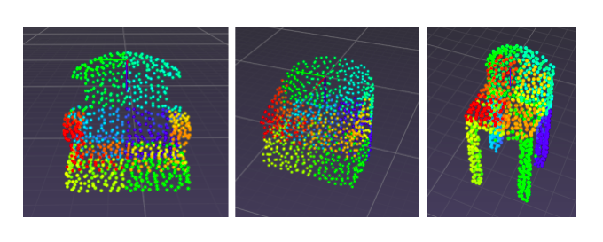
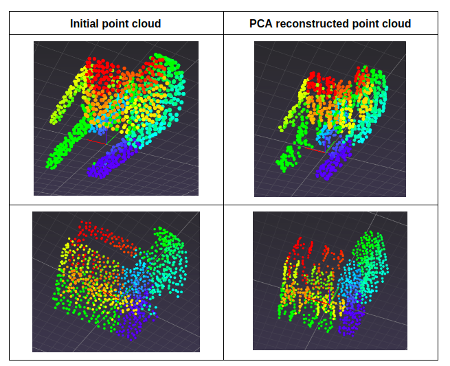
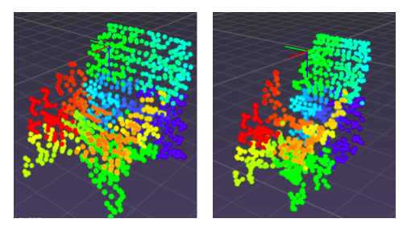

# Shape-Generation

## Introduction

This is Pytorch implementation of the paper on [Shape Generation Using Spatially
Partitioned Point Clouds](https://arxiv.org/pdf/1707.06267.pdf). 

## Pre Requisites

* Python 3.6
* torch==1.0.1
* torchvision==0.2.2
* open3d
* numpy
* tqdm

## Pre-Processing

1. An initial dataset of 5000 points clouds is taken from ShapeNet meshes representing chairs. 
2. Each point cloud contains 1000 points and they are sampled using Poisson disk sampling.
3. Each point cloud is centered at the origin, and the bounding box is normalized, so that the longest dimension spans [-0.5, 0.5]. 
4. After getting the data, store it in a folder called 'shapenet-chairs-pcd'
5. Run the pre-process file to order them using kd-tree, then get the bsis using pca and do itertive point order refinement.

```
python3 pre_process.py
``` 

6. This will store the true coefficents of pca for the next step.

## GAN Training

To train the model, run the following command:
```
python3 train.py 
```

Note: The argument paramemters have been set to their default values as mentioned in the paper.


## Inference

For inference run the file:

```
python3 infer.py --model_path ./models/exp1/weights_50
```

## Results

The initial point cloud after coloring them by index obtained by arraning in order using kd-tree is as shown below:



The resulting meshes after pca on true ground truth distrubtion is:



The new meshes generated using coefficients from GAN are as shown:

 